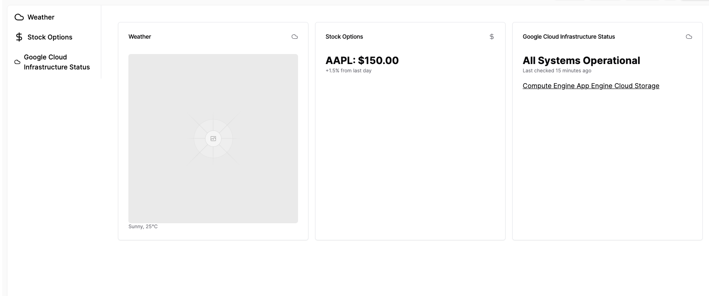

# Architecture

Monolith

Backend: Go
Frontend: NextJS or not...

DDD with hexagonal layered

Cache, Database: TBD

Communicate with telegram!

Use IaC for managing the infrastructure

## Release flow

master branch only

Using tags when deploying new versions

Use cloud build to deploy image

Store image in google artifact and deploy it in google cloud run
